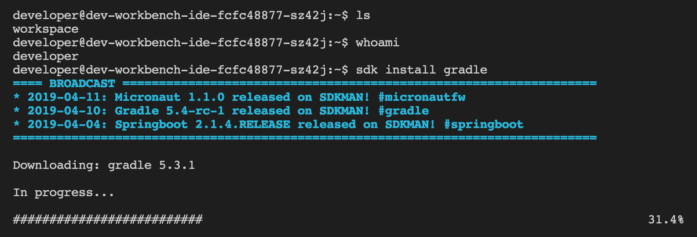

code-server-sdkman
===================

A Docker build file based on the offecial [code-server](https://github.com/codercom/code-server) image adding [sdkman](https://sdkman.io/), which enables to manage Java based SDKs from the code-server terminal:




Preinstalling SDKs
-------------------
If you want to bundle some SDKs to your image, extend this build file as follows:

```dockerfile
FROM iwauo/code-server-sdkman

ARG user="developer"
ARG home=/home/$user

USER $user
WORKDIR $home

ARG jdk=8.0.202-zulu
ARG gradle=5.3.1
ARG kotlin=1.3.30
SHELL ["/bin/bash", "-c"]

RUN source "$home/.sdkman/bin/sdkman-init.sh" \
 && sdk install java $jdk \
 && sdk install gradle $gradle \
 && sdk install kotlin $kotlin

ENTRYPOINT ["dumb-init", "code-server"]

```


